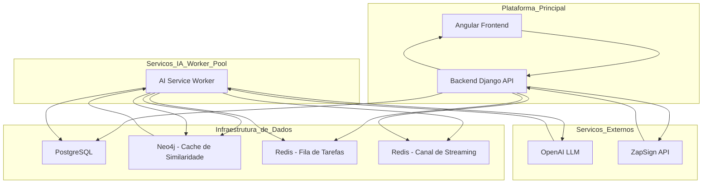

# API de Documentos e Insights


## Repositórios do Projeto

Esta solução é composta por três repositórios independentes:

* **[API Backend (Este Repositório)](./):** Orquestrador principal, CRUDs e integrações.
* **[Worker Pool LLM Service](https://github.com/SEU-USUARIO/worker_pool_llm_service):** Serviço de IA responsável pela análise, cache e persistência dos insights.
* **[Frontend Angular](https://github.com/SEU-USUARIO/frontend):** A interface de usuário para gerenciamento de documentos.


## 1. Descrição do Projeto

Este projeto implementa o backend para o novo módulo de gestão de documentos . O sistema permite o gerenciamento completo de empresas, documentos e signatários, e integra um serviço de Inteligência Artificial para extrair insights valiosos de contratos e outros documentos legais, otimizando o fluxo de trabalho e a tomada de decisão dos nossos clientes.


## 2. Arquitetura

A solução é composta por serviços desacoplados que se comunicam de forma síncrona (API RESTful) e assíncrona (Filas e Pub/Sub), garantindo escalabilidade e resiliência.

### Diagrama da Arquitetura

O diagrama abaixo ilustra o fluxo de dados e a interação entre os componentes do sistema, traduzido do seu rascunho.



### 3. Design System (Princípios de Arquitetura)

O desenvolvimento deste backend foi guiado por princípios de design de software que priorizam a manutenibilidade, testabilidade e escalabilidade do código.

* **Clean Architecture:** O código é estritamente separado em camadas:
    * **Domain:** Contém as entidades e regras de negócio puras, sem dependências de frameworks.
    * **Application:** Orquestra os fluxos de negócio (Use Cases).
    * **Infrastructure:** Implementa os detalhes técnicos como a API (Django), acesso ao banco de dados, e comunicação com serviços externos.

* **Repository Pattern:** A camada de `Application` não interage diretamente com o ORM do Django. Ela depende de interfaces de repositório definidas no `Domain`, permitindo que a forma de persistência de dados seja trocada sem impactar a lógica de negócio.

* **Injeção de Dependência (DI):** Um contêiner (`dependency-injector`) é responsável por instanciar e "injetar" as dependências (como repositórios e serviços) nos `Use Cases`, promovendo o desacoplamento e facilitando os testes unitários com mocks.

* **Comunicação Assíncrona:** Tarefas pesadas, como a análise de IA, são desacopladas da API principal através de uma fila no **Redis**, garantindo que a API permaneça rápida e responsiva. O streaming de resultados usa o padrão Pub/Sub, também via Redis.

### Nota Técnica: Otimização com Cache Vetorial em Neo4j
Para otimizar custos e latência com chamadas a APIs de LLMs, implementamos uma camada de cache de similaridade com Neo4j. O fluxo é simples e eficiente:

- Um novo documento é convertido em um vetor numérico (embedding) que representa seu significado semântico.

- Antes de chamar a OpenAI, consultamos o Neo4j usando sua busca vetorial nativa para encontrar documentos com embeddings similares já processados.

- Se um documento com alta similaridade é encontrado (Cache Hit), seu insight é reutilizado instantaneamente, economizando tempo e dinheiro.

- Caso contrário (Cache Miss), a análise prossegue, e o novo resultado (embedding + insight) é salvo no grafo, tornando o sistema mais inteligente a cada uso.

## 4. Como Executar o Projeto

### Pré-requisitos
* Docker & Docker Compose
* `make` (Opcional, para usar os atalhos do Makefile)

### Configuração Inicial
1.  Na raiz do projeto, copie o arquivo `.env.example` para `.env`.
2.  Preencha as variáveis de ambiente, especialmente a `OPENAI_API_KEY`.
3.  [cite_start]Cadastre uma empresa na aplicação e insira o `API Token` da sua conta do [Sandbox da ZapSign](https://sandbox.app.zapsign.com.br/) no campo correspondente[cite: 47, 48].

### Executando com Docker (Recomendado)
Para subir todo o ambiente (API, AI Service, Frontend, Bancos de Dados), execute na raiz do monorepo:
```bash
docker-compose up --build
```
* **API Backend:** `http://localhost:8000`
* **Frontend Angular:** `http://localhost:4200`

### Executando Localmente (Para Desenvolvimento)
Cada serviço (`backend`, `ai_service`) possui seu próprio `Makefile`. Para rodar localmente:
```bash
# No terminal 1, para o backend
cd backend/
make setup
make run

# No terminal 2, para o serviço de IA
cd ai_service/
make setup
make run
```

## 5. Como Rodar os Testes
Para garantir a estabilidade da API, a suíte de testes pode ser executada com o seguinte comando:
```bash
docker-compose exec backend pytest
```

## 6. Endpoints da API

A API é versionada e todos os endpoints estão sob o prefixo `/api/v1/`.

* **Documentação Interativa (Swagger UI):** A documentação completa da API, com todos os endpoints e modelos de dados, está disponível e pode ser testada em:
    * **[http://localhost:8000/api/v1/docs/](http://localhost:8000/api/v1/docs/)**

* **Autenticação:** A API utiliza JWT. Obtenha um token via `POST /api/v1/token/` e use-o no header `Authorization: Bearer <token>`.

* **Principais Rotas:**
    * `GET, POST /api/v1/companies/`
    * `GET, PUT, PATCH, DELETE /api/v1/companies/{id}/`
    * `GET, POST /api/v1/documents/`
    * `POST /api/v1/signers/{id}/start-signing-process/`
    * `GET /api/v1/documents/{id}/insights/stream/`
    * `POST /api/v1/webhooks/zapsign/`
